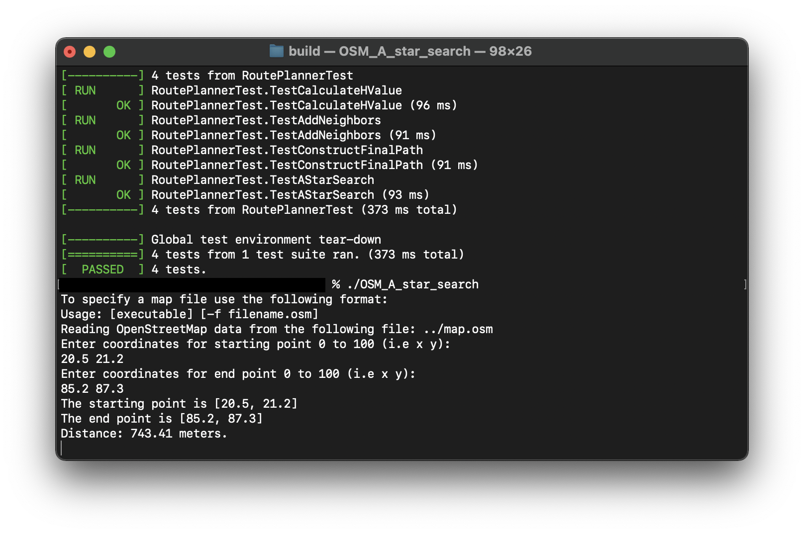
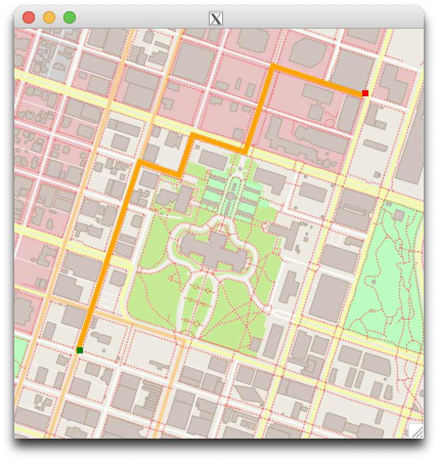

# Route_Planning_Project
Welcome to the first project of C++ Nanodegree!

In this project, I created a route planner that plots a path between two points on a map using real map data from the [OpenStreeMap project](https://www.openstreetmap.org/#map=5/-28.153/133.275) based on the A* search algorithm.

<center> </center>

## Environment
👉 macOS 11.5.2 Big Sur with Intel Core i7 chip  
👉 Homebrew 3.2.10  
👉 cMake 3.21.2  
👉 GNU Make 3.81  
👉 C++ 17  
👉 Apple clang version 12.0.5  
👉 IO2D. [Cairo/Mac](https://github.com/cpp-io2d/P0267_RefImpl/blob/master/BUILDING.md#cairoxlib-on-macos) or [CoreGraphics/Mac](https://github.com/cpp-io2d/P0267_RefImpl/blob/master/BUILDING.md#coregraphicsmac-on-macos) or [Big Sur Instructions](InstallingIO2D_BigSur.md)

## Compiling and Running
### Compile
Before compiling this repository, please modify `variables.zsh` with your project absolute path and then `source variables.zsh` to export the `CXXFLAGS` and `LDFLAGS`.

Create a `build` folder and change to that directory
```
mkdir build && cd build
```

Within the build directory run
```
cmake ..
make
```

### Running
The executable is within the `build` directory. You can run it as follows
```
./OSM_A_star_search
```

## Testing
Udacity has provided a series of GoogleTests and you can run them within the build directory as follows
```
./test
```
